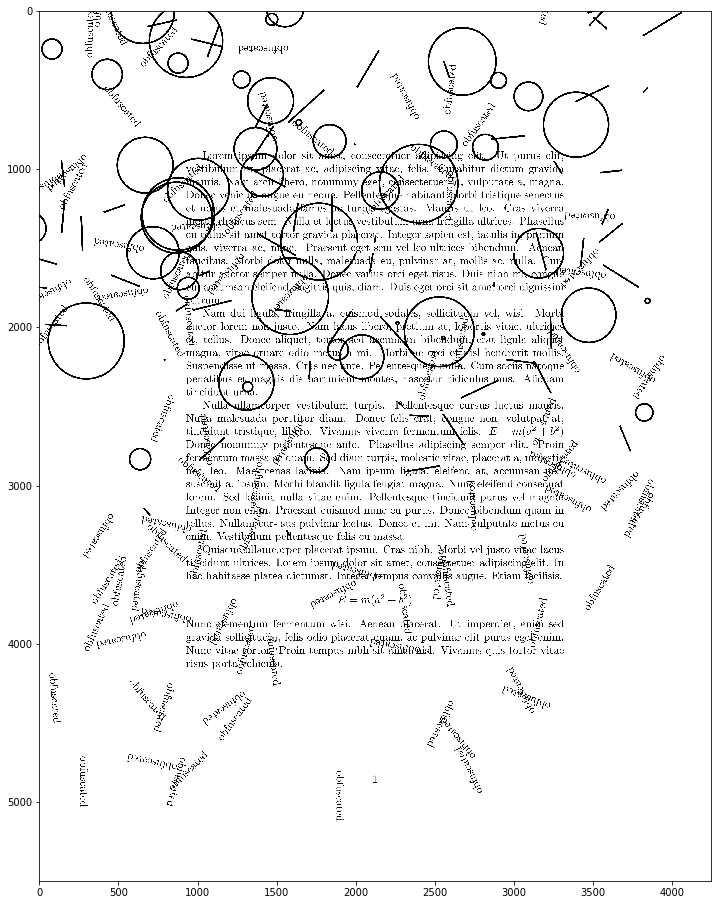
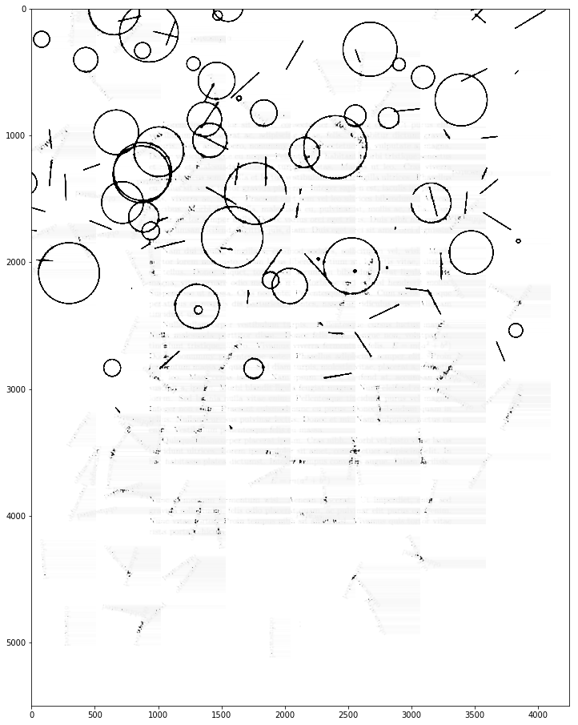
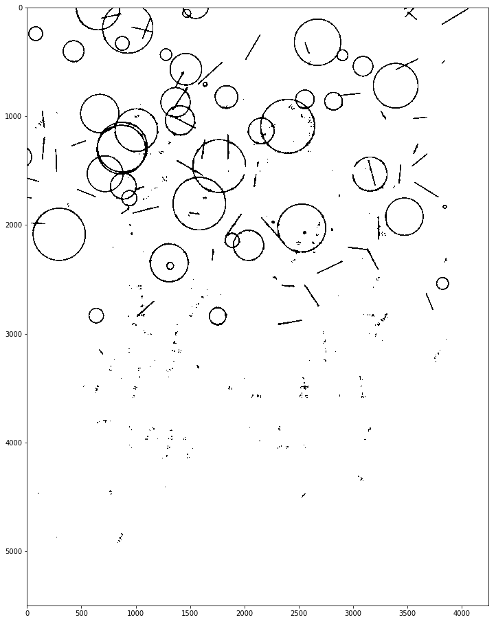
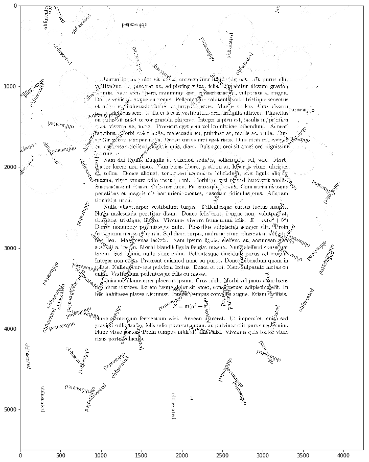
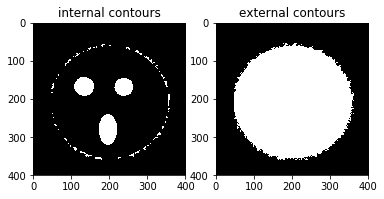
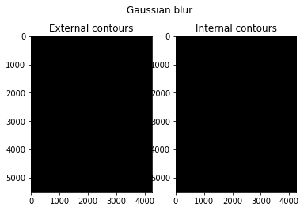
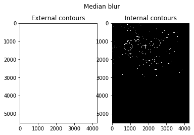
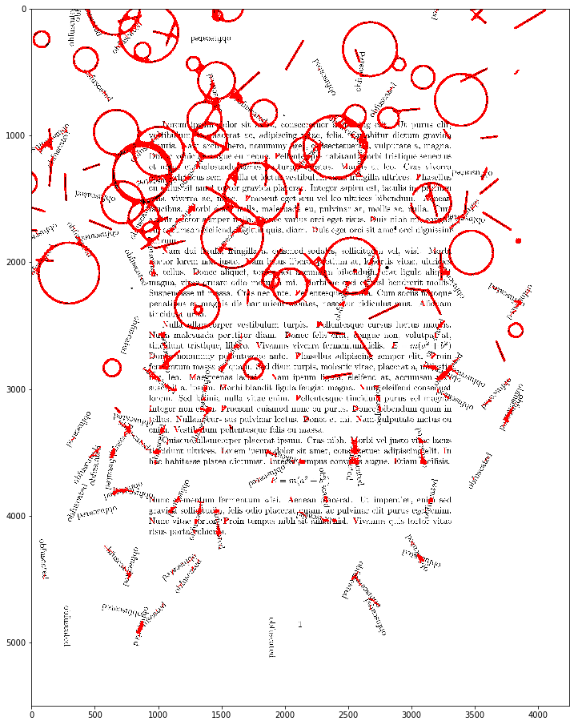
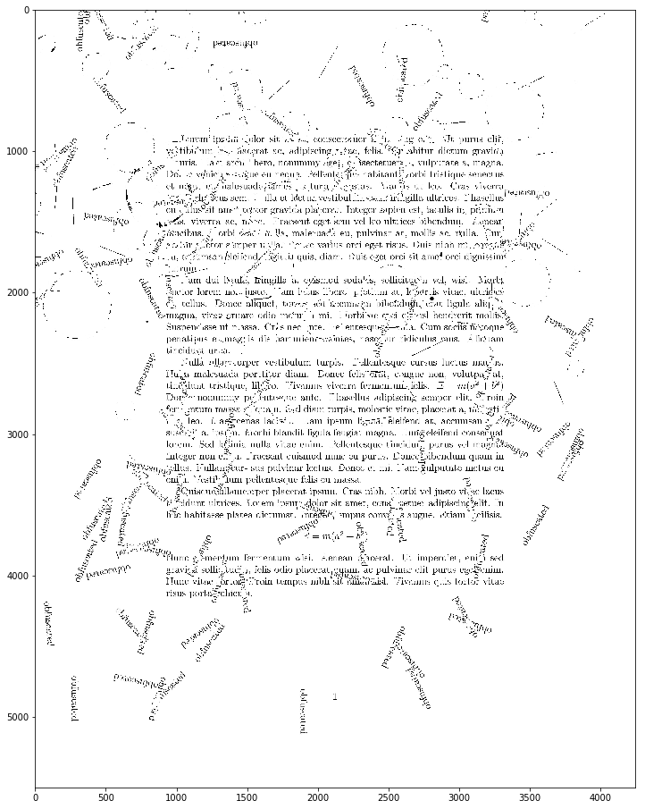

As an exercise in Python and OpenCV I wanted to try removing some obfuscating patterns from a PDF file. This could potentially come in handy if, as a university student, I had access to some lecture files with obfuscation patterns, and I wanted to save up on the ink while printing them out ;)

The PDF file was generated using LaTeX. [This post](https://tex.stackexchange.com/questions/35133/how-to-add-random-lines-over-text-as-a-watermark-and-anti-ocr) on TeX Stack Exchange was of much help.

Essentially any pattern removal procedure will require the following steps:
1. Blur the image (so the text doesn't interfere with the contour matching process).
2. Look for the contours and save them in a contour image.
3. Go through the original image and set the pixel colour to white for every black pixel in the contour image.

To remove the circles and lines I'm going to try out 3 different methods: naive removal, the built-in findContours method (which uses the [Satoshi Suzuki algorithm](https://www.sciencedirect.com/science/article/pii/0734189X85900167) that looks for "external" and "internal" borders), and the built-in and houghLinesP method (which uses the [Hough transform](https://en.wikipedia.org/wiki/Hough_transform)). Note that how each of these perform may vary on an image-to-image basis, and I may introduce some other techniques at different stages.

tl;dr don't believe anything I say, try it out on your own.

### Initial preparation

To begin with I need to extract the image from the PDF file. Note that the pdf2image package is just a wrapper around a system call to the pdf2image package so you need to have it installed on your computer. Obviously, you can skip this step and just take a screenshot of the pdf file...



from pdf2image import convert_from_path
import matplotlib.pyplot as plt
import numpy as np
import cv2
%matplotlib inline

# a little helper function to display our image in a bigger plot
def display_img(image):
    fig = plt.figure(figsize=(20,16))
    ax = fig.add_subplot(111)
    ax.imshow(image, cmap="gray")



```python
pages = convert_from_path('../content/varia/obfuscated.pdf', 500)
pages[0].save('obfuscated.jpg', 'JPEG')
```

(Note that if you have a multi-line PDF you have to iterate through all the pages at this point.)


```python
img = cv2.imread('obfuscated.jpg', 0) #read in as a grayscale image
```


```python
display_img(img)
```





### Naive removal

Naive removal is the simplest method imaginable: since the circles and lines are slightly thicker than the text, it is possible to blur the image to the point where the text is no longer visible but the outlines of the figures still are. This approach doesn't solve the issue of the "obfuscated" watermark text, but may be moderately effective against any thicker outlines.


```python
img_med = cv2.medianBlur(img, ksize=15)
```

cv2.medianBlur applies a [median filter](https://en.wikipedia.org/wiki/Median_filter) with a k-by-k-sized aperture (15x15 in this case). The value is chosen arbitrarily -- note that it has to be an odd number. The main trade-off here is that the bigger the apperture size, the more details I'm losing, including the contour thickness. The difference is going to become more prominent in the next step when I set the binary threshold.


```python
display_img(img_med)
```





```python
ret, th_img = cv2.threshold(img_med, thresh=127, maxval=255, type=cv2.THRESH_BINARY)
```

In essence the cv2.threshold function allows me to set a threshold for the pixels in a given image. In this case, any pixels with the value above 127 will become 1s (white) and other pixels will become 0s (black), as the threshold is binary. Depending on the picture you can play with the threshold values -- while 255 is a pretty standard value, 127 is arbitrary and may be worth changing depending on the picture.


```python
display_img(th_img)
```





Now I can use the blurred and thresholded image to filter out the pixels from the original image. Any pixels which are black in the blurred and thresholded image are set to white in the original image:


```python
img_dest = img.copy()
img_dest[th_img==0] = 255
```


```python
display_img(img_dest)
```





Not that bad for a naive method! While the "obfuscated" text is still there, the contours are (mostly) gone -- there are some leftover artifacts. The text isn't perfectly readable, but I can think of a few improvements to make it better (play with the aperture size and the threshold values, apply a [2d filter](https://docs.opencv.org/2.4/modules/imgproc/doc/filtering.html#filter2d) with some simple kernel, etc).

### findContours

(I'm not going to pretend having read all the maths behind this, but) What this function does is it looks for curves joining all the continuous points of the same colour and intensity along a certain boundary and then returns a hierarchy containing, among all, the information whether the contour is external or internal. The easiest way to see the difference between the external and internal boundaries is to, well, see the difference:


```python
smile = cv2.imread('smile.jpg', 0)

contours,hierarchy = cv2.findContours(smile, mode=cv2.RETR_CCOMP, method=cv2.CHAIN_APPROX_SIMPLE)
external_contours = np.zeros(smile.shape)
internal_contours = np.zeros(smile.shape)
for index, el in enumerate(contours):
    if hierarchy[0][index][3] == -1:
        cv2.drawContours(external_contours, contours, index, 255, -1)
    else:
        cv2.drawContours(internal_contours, contours, index, 255, -1)
```


```python
plt.subplot(121)
plt.imshow(internal_contours, cmap='gray')
plt.title('internal contours')

plt.subplot(122)
plt.imshow(external_contours, cmap='gray')
plt.title('external contours')
    
plt.show()
```





This doesn't work perfectly but it illustrates the difference.

This time let's try out [the Gaussian blur](https://en.wikipedia.org/wiki/Gaussian_blur).


```python
img = cv2.imread('obfuscated.jpg', 0)
img_gauss = cv2.GaussianBlur(img, ksize=(17,17), sigmaX=10)
display_img(img_gauss)
```


As you can see this has a very different effect -- the elements are blurred as if they were seen through a pane of thick glass. Let's try to detect the contours.


```python
contours_gauss, hierarchy_gauss = cv2.findContours(img_gauss, mode=cv2.RETR_CCOMP, method=cv2.CHAIN_APPROX_SIMPLE)
```


```python
hierarchy_gauss.shape
```


    (1, 4, 4)


```python
len(contours_gauss)
```


    4


It looks like it only found 4 contours! That's a bummer. Let's quickly compare it to the output of medianBlur...


```python
contours_med, hierarchy_med = cv2.findContours(img_med, mode=cv2.RETR_CCOMP, method=cv2.CHAIN_APPROX_SIMPLE)
```


```python
hierarchy_med.shape
```


    (1, 487, 4)


```python
len(contours_med)
```


    487


This one, on the other hand, found A LOT of contours. Let's turn each of them into their contour images. For that I'm going to use a function which draws the contours (either internal or external) on a frame.


```python
def draw_contour_ex_in(contours, hierarchy, image, contourExternal):
    frame = np.zeros(image.shape)
    for i, el in enumerate(contours):
        if contourExternal:
            if hierarchy[0][i][3] == -1:
                cv2.drawContours(frame, contours, i, 255, -1)
        else:
            if hierarchy[0][i][3] != -1:
                cv2.drawContours(frame, contours, i, 255, -1)
    return frame
```


```python
found_contours = [contours_gauss, contours_med]
found_hierarchies = [hierarchy_gauss, hierarchy_med]
labels = ['Gaussian blur', 'Median blur']

for index, el in enumerate(found_contours):
    
    img_copy = img.copy()
    
    frame_ex = draw_contour_ex_in(found_contours[index], found_hierarchies[index], img_copy, True)
    frame_in = draw_contour_ex_in(found_contours[index], found_hierarchies[index], img_copy, False)
    
    plt.subplot(121)
    plt.imshow(frame_ex, cmap='gray')
    plt.title('External contours')
    
    plt.subplot(122)
    plt.imshow(frame_in, cmap='gray')
    plt.title('Internal contours')
    
    plt.suptitle(labels[index])
    
    plt.show()
    
    print('\n\n')
```





    
    
    





    
    
    


It looks like not only the median blur outperformed Gaussian blur in this task but also all the contours found were internal rather than external. Let's flip the colours on the last frame (internal contours, median blur) and try removing them from our original image.


```python
img_find_contours = img.copy()
frame_median_in = draw_contour_ex_in(contours_med, hierarchy_med, img_find_contours, False)
ret, frame_median_in_flipped = cv2.threshold(frame_median_in, thresh=0.5, maxval=1, type=cv2.THRESH_BINARY_INV)
img_find_contours[frame_median_in_flipped == 0] = 255
```


```python
display_img(img_find_contours)
```


Turns out the naive method performed better on this page (at least when it comes to pattern removal). I'm kind of disappointed because earlier I tried it out on some other images and it worked much better but again, you could potentially play with the blur values and the approximation method to influence the output.

### Hough transform

The final technique to use is the Hough transform. This method is well explained [on Wikipedia](https://en.wikipedia.org/wiki/Circle_Hough_Transform). I also enjoyed [this article](https://alyssaq.github.io/2014/understanding-hough-transform/). Since it works best with edges and our circles have a certain thickness to them, I'm going to first blur the image and apply a binary threshold to it, then use a [canny edge detector](https://en.wikipedia.org/wiki/Canny_edge_detector) to get just
the edges of our image, and finally apply the HoughLinesP (probabilistic Hough Line) function to detect the lines and circles and later remove them from the final image.


```python
img_gauss = cv2.GaussianBlur(img, ksize=(13,13), sigmaX=10)
ret, img_gauss_th = cv2.threshold(img_gauss, thresh=127, maxval=255, type=cv2.THRESH_BINARY)
display_img(img_gauss_th)
```



edges = cv2.Canny(image=img_gauss_th, threshold1=240, threshold2=255)
edges_smoothed = cv2.GaussianBlur(edges, ksize=(5,5), sigmaX=10)



```python
display_img(edges_smoothed)
```


```python
lines = cv2.HoughLinesP(edges_smoothed, rho=1, theta=1*np.pi/180, threshold=40, minLineLength=30, maxLineGap=25)
```


```python
img_lines = cv2.cvtColor(cv2.imread('obfuscated.jpg'), cv2.COLOR_BGR2RGB)
```


```python
line_nos = lines.shape[0]
for i in range(line_nos):
    x_1 = lines[i][0][0]
    y_1 = lines[i][0][1]    
    x_2 = lines[i][0][2]
    y_2 = lines[i][0][3]    
    cv2.line(img_lines, pt1=(x_1,y_1), pt2=(x_2,y_2), color=(255,0,0), thickness=2)
```


```python
display_img(img_lines)
```





Not that bad -- the line method actually picked up on most circles as well. Let's use the same code as above to remove the patterns by drawing them in white:


```python
img_hough_lines_contours = np.ones(img.shape)

line_nos = lines.shape[0]
for i in range(line_nos):
    x_1 = lines[i][0][0]
    y_1 = lines[i][0][1]    
    x_2 = lines[i][0][2]
    y_2 = lines[i][0][3]    
    cv2.line(img_lines, pt1=(x_1,y_1), pt2=(x_2,y_2), color=(255,0,0), thickness=2)
    
img_hough_lines = img.copy()

img_hough_lines[img_hough_lines_contours == 0] = 255
```


```python
display_img(img_hough_lines)
```





Again, you can play with the parameters of the Hough transform (depends on whether you want to err on the side of cautious or unreadable).