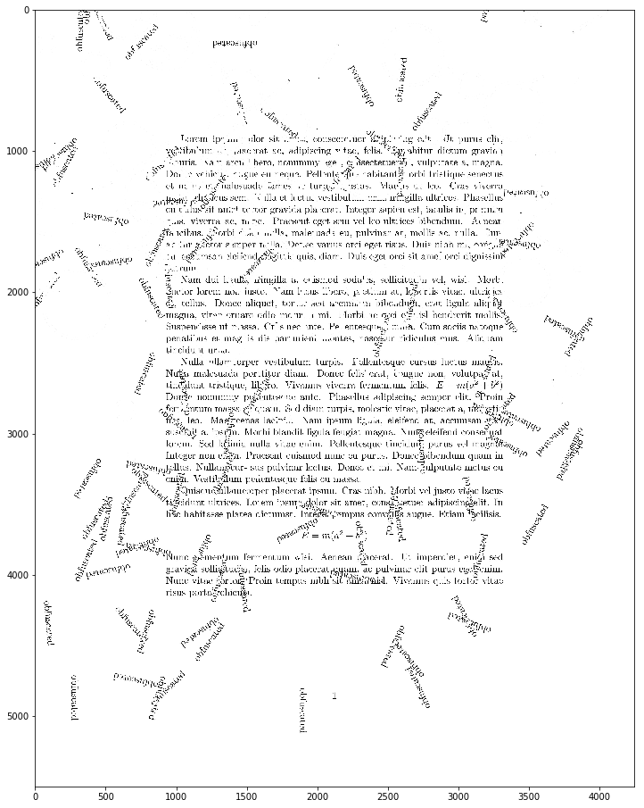

It took me a while to come up with an (at least) semi-effective method of removing the text pattern. While the thicker outlines can be disposed of pretty easily ([click](https://magda.space/removing-circles-lines-patterns-part-1.html), [click](https://magda.space/removing-circles-lines-patterns-part-1-5.html)), developing a method which wouldn't harm the text too much turned out to be much more challenging.


```python
import matplotlib.pyplot as plt
import numpy as np
import cv2
%matplotlib inline

# a little helper function to display our image in a bigger plot
def display_img(image):
    fig = plt.figure(figsize=(20,16))
    ax = fig.add_subplot(111)
    ax.imshow(image, cmap="gray")
```


```python
img = cv2.imread('obfuscated.jpg', 0)
img_med = cv2.medianBlur(img, ksize=15)
ret, th = cv2.threshold(img_med, 80, 255, cv2.THRESH_BINARY)
kernel = np.ones((3,3),np.uint8)
eroded_img = cv2.erode(th,kernel,iterations=2)
img_dest = img.copy()
img_dest[eroded_img == 0] = 255
```


```python
display_img(img_dest)
```





First, let's remove the obfuscation from the margins by simply changing the colour of all the margin pixels to white.


```python
img_dest[:, :900] = 255
img_dest[:, 3350:] = 255
img_dest[:900, :] = 255
img_dest[4200:, :] = 255
```


```python
display_img(img_dest)
```


Next -- erode the image with a horizontal kernel to get some "FBI-redacted" style text.


```python
kernel = np.ones((6,16),np.uint8)
eroded = cv2.erode(img_dest,kernel,iterations=6)
ret, th = cv2.threshold(eroded, 127, 255, cv2.THRESH_BINARY)
```


```python
display_img(th)
```


As you can observe, the iritating vertical blobs are the remaining "obfuscated" tags. At this point I hoped I could get something out of this by measuring the gradient directions, but it would take way too much text away with it... so custom methods it is.

First, if in any row there is less black than my expected threshold, then the whole row can go to hell.


```python
for index, row in enumerate(th):
    if cv2.countNonZero(row) > 0.6*len(row):
        th[index] = np.uint8(np.repeat(255,len(row)))
```


```python
display_img(th)
```


Second, to only leave the longest sequence in the row let's first dilate it even more. (The kernel size depends on the line height -- if it's bigger and if there's more space between lines you can afford adding a bit more in the vertical axis. In this case it would turn the text into very thin lines.)


```python
kernel = np.ones((2,8),np.uint8)
dilated = cv2.dilate(th,kernel,iterations=7)
```


```python
display_img(dilated)
```


```python
img_dest[dilated == 255] = 255
```


```python
display_img(img_dest)
```


Again, depending on the exact document, you may have to use different parameters with the morphological operators, and the effect will be more (or less) prominent.
